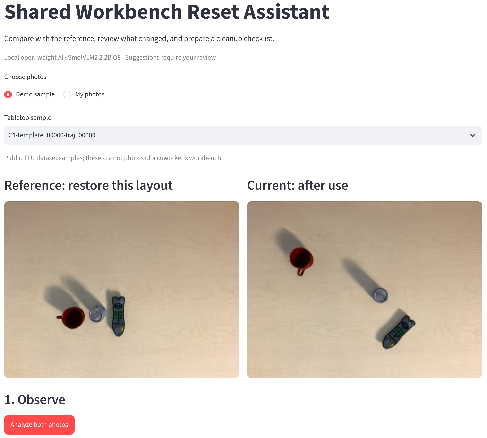

# Shared Workbench Reset Assistant

A Weekend Challenge prototype for a coworker who has trouble remembering where
objects originally belonged on a shared workbench. The app uses a local
open-weight vision-language model to draft observations and a cleanup checklist
for human review.

## Workflow

1. View the reference and current photos side by side.
2. Review and correct the local AI's observations against the photos.
3. Draft a cleanup checklist from the corrected observations.
4. Review and edit the checklist, then export the confirmed result as JSON.

See [Project Flow](project-flow.md) for the detailed workflow, deliverables,
and progress.

## Run the Browser Demo

See [Local Demo Setup and Usage](setup.md) for model downloads, server and UI
setup, startup commands, and the reviewed export workflow.

## Dataset Attribution and License

Demo images come from the [Tabletop Tidying Up (TTU) Dataset](https://github.com/rllab-snu/TTU-Dataset), created by Hogun Kee, Wooseok Oh, and Songhwai Oh (2024). See [CITATION.cff](data/CITATION.cff) for citation details.

See [LICENSE.txt](data/LICENSE.txt) for the preserved upstream license notice. The upstream README states an MIT license. The preserved notice names Othneil Drew (2018), which should not be confused with the dataset authors. A separate data-specific license has not been verified.

## References

- [llama.cpp server](https://github.com/ggml-org/llama.cpp/blob/master/tools/server/README.md) — local inference server documentation.
- [SmolVLM2 2.2B Instruct GGUF](https://huggingface.co/ggml-org/SmolVLM2-2.2B-Instruct-GGUF/tree/main) — Q8_0 model and vision projector files for the browser demo.
