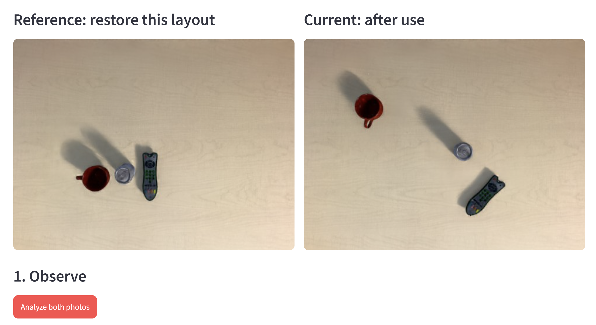
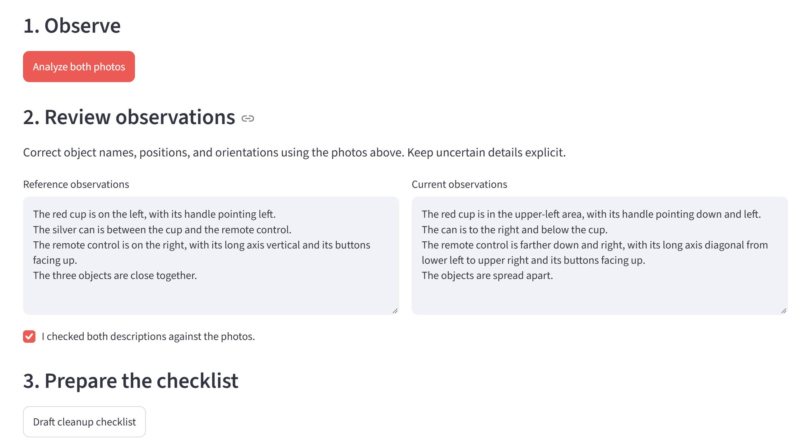
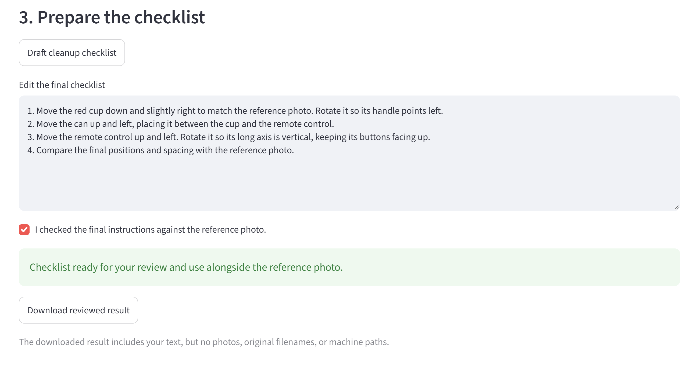

*This is a submission for the [Hacktoberfest Weekend Challenge: Build for a Friend](https://dev.to/challenges/hacktoberfest-weekend-2026-10-01)*

<!-- Before publishing: upload the screenshots through the DEV editor and replace
the relative image URLs below with the returned URLs. Push the referenced project
files to GitHub. No public deployment, video, or saved agent-session link exists yet.
Prize Categories is omitted because no partner category is being claimed. -->

## What I Built

I built **Shared Workbench Reset Assistant** for one coworker who has trouble
remembering where objects originally belonged on our shared workbench.

The idea is simple: keep a reference photo of the intended layout, compare it
with a photo taken after use, and prepare a short checklist for putting things
back. The reference photo provides a visual memory of the workspace.

The prototype uses a local open-weight vision-language model to draft observations
and a cleanup checklist. Both remain editable, and the user must review them
against the photos before exporting a result. I have completed one demo workflow,
but I have not yet tested it with my coworker or collected their feedback.

## Demo

<!-- Add a deployed link or video demo here before publishing. The screenshots
below show the local prototype; they are not a public deployment or video. -->

The app runs locally in a browser. For a reproducible demonstration, I used public
[Tabletop Tidying Up (TTU) dataset](https://github.com/rllab-snu/TTU-Dataset) images,
not photographs of our company workbench.

The C1 sample contains a red cup, a beverage can, and a remote control. I assigned
the first frame as the reference and the last frame as the current layout; these
are prototype roles, not verified official tidy/untidy labels.

*Left: the layout to restore. Right: the starting layout after use.*

The workflow is:

1. Analyze the two photos independently.
2. Correct and confirm the model's observations.
3. Generate a checklist from those reviewed observations.
4. Edit and confirm the final checklist, then download the result as JSON.

*The observations shown here were corrected with my coding assistant's help and
confirmed against the photos before drafting the checklist.*

*This final checklist was corrected with help from my coding assistant and checked
against the photos. It is not the local model's unedited output.*

## Code

[Project repository](https://github.com/johyeongseob/hacktoberfest-2026)
· [Weekend project and setup](https://github.com/johyeongseob/hacktoberfest-2026/tree/main/dev-challenge/weekend-challenge)

The main files are `app.py` for the Streamlit interface, `workbench.py` for local
inference requests and image preparation, and `start_model_server.sh` for starting
llama.cpp. Model weights are downloaded separately and excluded from Git.

## How I Built It

I used [SmolVLM2 2.2B Instruct in Q8 GGUF format](https://huggingface.co/ggml-org/SmolVLM2-2.2B-Instruct-GGUF),
including its vision projector, through a local [llama.cpp](https://github.com/ggml-org/llama.cpp)
server. [Streamlit](https://github.com/streamlit/streamlit) provides the interface.
The app runs on the CPU in WSL Ubuntu 24.04 on my Intel Core Ultra X7 358H laptop
with 32 GB of RAM. No GPU or model fine-tuning was used.

I first tried SmolVLM2 500M with two images, five ordered images, and a supplied
object inventory. The results contained repetition, incorrect directions, or
incomplete guidance. Moving to 2.2B did not solve the restoration task reliably.

In the completed browser run, the model took 7.01 seconds to describe the reference
and 6.74 seconds to describe the current photo. It misreported the current cup's
handle direction and the remote's face orientation. Even after I corrected the
observations with my coding assistant's help, the 5.09-second checklist response
mixed descriptions of both layouts instead of giving movement instructions.
These timings describe one run, not a benchmark.

I therefore corrected the final instructions with my coding assistant and reviewed
them against the images. The export preserves the original model responses,
reviewed observations, final checklist, and confirmation flags so readers can
see exactly what required correction. Expected-result annotations were not
provided to the model.

The current result demonstrates the review and export workflow. It does not
establish reliable automatic spatial reasoning or a reduction in cleanup time.

TTU was created by Hogun Kee, Wooseok Oh, and Songhwai Oh (2024). The source,
preserved upstream license notice, citation, and licensing caveat are documented
in the project README. The sample images are third-party demo data.

## Why Does Open Innovation Matter?

Local inference lets me analyze the photos without sending them to a hosted model
API. The app normalizes uploaded images in memory and sends them to a fixed
localhost endpoint. It does not save uploaded photos to the repository, and the
result export contains text rather than embedded photos.

Open weights and an editable inference stack also let me compare models and
inspect failures on my own laptop. I could change prompts, retain unsuccessful
outputs, and add review steps without depending on a provider's hosted model.
There is no hosted inference API fee, although hardware and electricity still
have costs. I have not yet verified the complete app with the internet disconnected.

This weekend is the first step in my month-long exploration of VLA and Physical
AI, alongside my separate contributions to Intel's
[Physical AI Studio](https://github.com/open-edge-platform/physical-ai-studio).
This prototype uses a VLM and does not integrate Physical AI Studio or execute
robot actions. My next step is coworker feedback and better visual grounding
before considering a robot policy.

## My Agent Session

<!-- Optional: after saving and reviewing a sanitized DevRelay session, insert
its real link or agent_session embed here. No session has been uploaded yet. -->

I used Codex to help implement the app, debug experiments, correct demo observations
and instructions, and draft this post. The local SmolVLM2 responses are preserved
separately from those assisted corrections. The prototype still needs a coworker
trial and broader evaluation.

Experiment results and the reviewed JSON export are kept locally and excluded
from Git. The screenshots show the reviewed workflow; they are not a saved
agent-session transcript.
